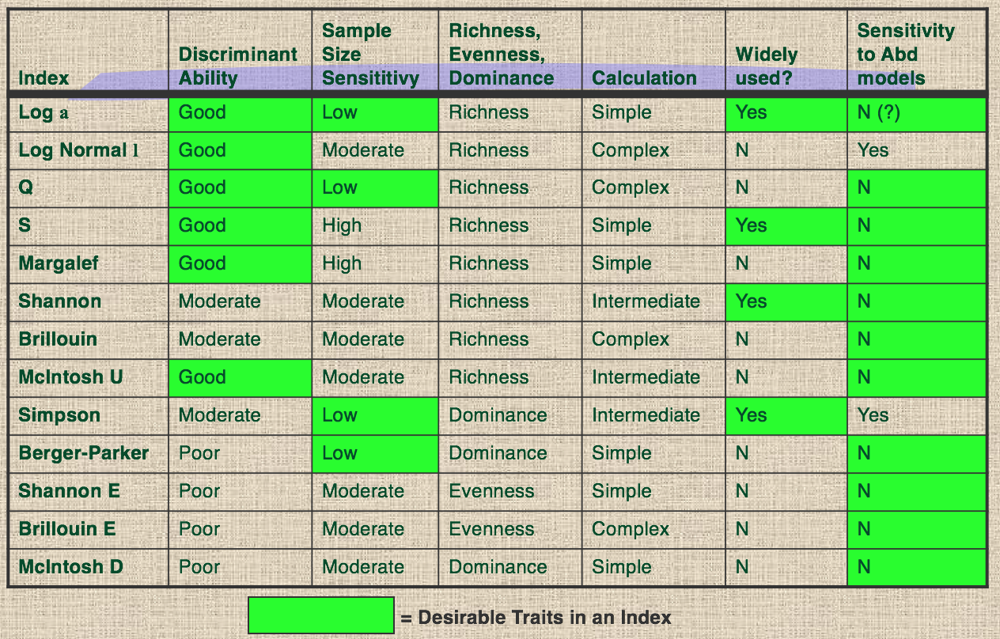
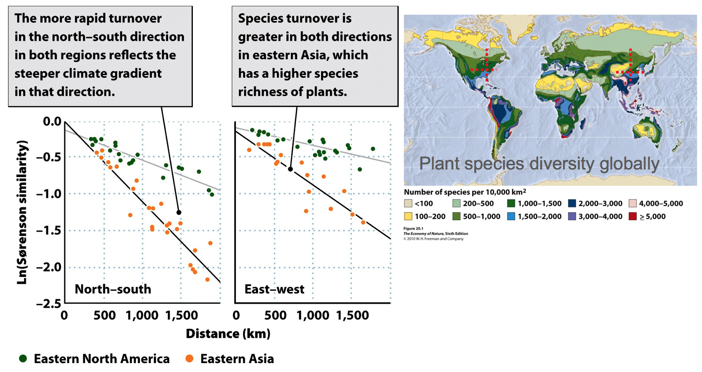

<!-- 
html_document
ioslides_presentation
- include my notes in the presentation
- include my code 
- include extentions to outher resources
- can you include audio clips for watching at home?
- how to include feedback from students to questions?
- can translate directly in to code chunks
-->


```{r echo=FALSE}
library(vegan)
data(BCI)

```

## This Presentation {.smaller}

interactive slides available at

[http://protea.eeb.uconn.edu:3838/cory/Biodiversity_Indices/](http://protea.eeb.uconn.edu:3838/cory/Biodiversity_Indices/) or 

[cmerow.shinyapps.io/Biodiversity_Indices](https://cmerow.shinyapps.io/Biodiversity_Indices)

  - open in chrome, if you have it
  - p shows notes associated with each slide (on macs)

 <div class="notes">
 
  - These will help both of us remember what I meant to say on each slide
  - o gives overview of slides (on macs, sometimes on PCs)
  - w allows widescreen
  - f allows fullscreen
  - if you see code at the top of your window, just reload the page (Command+R on Macs)
  
 </div>

```{r echo = FALSE}
inputPanel(
  sliderInput("nreps", label = "Number of replicate samples", min = 2, max = 100, value = 3)
)

renderPlot({
  spa <- specaccum(BCI,method='random')
  par(mar=c(20,12,3,20))
  plot(spa$sites,spa$perm[,1],xlab='# sites',ylab='# species', main='species accumulation curves',type='l',las=1,bty='n',ylim=c(80,230))
  for (i in seq_len(NCOL(spa$perm[,1:input$nreps]))){
    lines(spa$sites, spa$perm[,i])}
})
```


```{r, echo=FALSE,eval=FALSE}
H <- diversity(BCI)
## Species richness (S) and Pielou's evenness (J):
S <- specnumber(BCI) ## rowSums(BCI > 0) does the same...
J <- H/log(S)
## Rarefaction
(raremax <- min(rowSums(BCI)))
Srare <- rarefy(BCI, raremax)
plot(S, Srare, xlab = "Observed No. of Species", ylab = "Rarefied No. of Species")
abline(0, 1)
rarecurve(BCI[1:3,], step = 20, sample = raremax, col = "blue", cex = 0.6)

rad <- radfit(BCI[1,])
rad
print(radlattice(rad))

sac <- specaccum(BCI)
plot(sac, ci.type="polygon", ci.col="yellow")

beta <- vegdist(BCI, binary=TRUE)
mean(beta)

betadiver(help=TRUE)
z <- betadiver(BCI, "z")

specpool(BCI)
#If the estimation of pool size really works, we should get the same values of estimated richness if we take a random subset of a half of the plots (but this is rarely true):
s <- sample(nrow(BCI), 25)
specpool(BCI[s,])

#The specpool function needs a collection of sites, but there are some methods that estimate the num- ber of unseen species for each single site. These functions need counts of individuals, and species seen only once or twice, or other rare species, take the place of species with low frequencies. Function estimateR implements two of these methods:
estimateR(BCI[1,])
  
#Fisher’s alpha is a measure of diversity that takes into account variability in stem number.  You can calculate that with vegan as well:

fish.a<-fisher.alpha(BCI, MARGIN = 1)
fish.a	#shows you the values in the object "fish.a" that you made.


#This returns Fisher’s alpha for all of the hectares.  Since Fisher’s alpha is supposed to be invariant with sample size, we can test that with the BCI data:

bcitot<-apply(BCI, 2, sum) #gives you the total number of individuals for the 50 ha plot
bcitot.a<- fisher.alpha(bcitot, MARGIN = 1) #calculates fisher’s alpha on all 50 ha combined.

# calculate Fisher’s alpha for increasing numbers of hectares combined.

x<-2:50	#makes a sequence of numbers 1:50 that represent the hectares
a<-NULL	#sets up an empty object we’ll fill with results
for (i in x){	#tells R to give i each value in the object x
  b<- apply(BCI[1:i,], 2, sum)	#get the sum of i hectares.
  c<- fisher.alpha(b, MARGIN = 1) #work the fisher’s alpha magic on it
  a<- c(a,c)		#stick the new result on the end of the old data
}
plot(x, a)		#plot the data

```

<!-- ---------------------------------------------------------------------------------- -->
## Main Points

__Biodiversity__

The sum total of taxonomic, genetic, functional, phylogenetic, and ecological diversity found in an area (habitat, region, continent, or the biosphere).

> 1. Quantifying biodiversity is difficult (Data collection and modeling)
> 2. Diversity = Richness & Evenness
> 3. Estimate unobserved species? Really?
> 4. How to compare diversity between communities
> 5. Species aren't the only units of diversity

 <div class="notes">
 - all models are wrong, some are useful
 - the nature of biodiversity measurement is that there are __loads__ of metrics for a range of comparisons. I'm going to show you 1 example of each common comparision. If you're in a position to conduct a biodiversity assessment, then it's time to look up the pros and cons of different metrics for a particular task.
 
 </div>
<!-- ---------------------------------------------------------------------------------- -->
## Why measure diversity?  

  - Higher Diversity => ecosystem health
    + increased stability;  i.e. biotic components are less likely to go extinct; increased redundancy of biotic components. 
    + Increased resilience of the system (i.e. increased capacity of the ecosystem to respond to environmental change or disturbance by resisting damage and recovering quickly).
    + increased productivity => potential for human use
    + increased evolutionary potential. 
 
  - A baseline for detecting change

  <div class="notes">
  
  Diverse habitats with a variety of plants can have benefits such as: 
  
  - forage for other species
  - Stability resulting from species able to survive disturbance
  - variety of genetic material useful in long term survival and stability
  - The community benefits from a mixture of plants:
    + soils improve with nitrogen fixers, deep rooted plants bring nutrients up from soil layers 
    + some species work together (mutualism, commensalism) 
  - Healthy diverse plant communities generally have all niches filled and are theoretically less likely to be invaded

  </div>
  
<!-- ---------------------------------------------------------------------------------- -->
## Diversity = Richness & Evenness {.smaller}

Richness
 
  > -  = __number of species__ (or groups) present
  > -  Elephant, rhino and lion is less diverse than 
  > -  Elephant, rhino, lion, leopard and buffalo

Evenness 
 
  > -  = how __different abundances__ are among species
  > -  maximum evenness = all species have the same # individuals
  > -  minimum evenness = all individuals are the same species
  > -  1000 elephants and 1 lion is less diverse than
  > -  500 elephants and 500 lions
  > -  measured with a large variety of indices (Shannon, Simpson, $\alpha$, etc.)

  <div class="notes">
  
  - Richness: numbers of species (or other fundamental units) present in a particular area.
  - Biodiversity indices: relative proportional  representation of species (or other fundamental units of biodiversity) in a particular area or sample. 
 
  </div>

<!-- ---------------------------------------------------------------------------------- -->
## Data - BCI, Panama
  - Dry tropical forest canopy trees
  - 50 1 hectare plots
  - 225 species observed
```{r,echo=FALSE}
head(BCI,5)[,1:6]
```


  <div class="notes">
  
  - columns are species (225)
  - rows are 1 hectare plots (50)
  - you're just looking at the beginning of the data table
  
  </div>  
  
<!-- ---------------------------------------------------------------------------------- -->
## Sampling methods 

Definition of sampling: some members of a population are selected as representatives of the entire population

  > - define a community (location in space/time that's reasonably closed)
  > - reasonably homogeneous habitat
  > - best to observed individuals
  > - can count species (not covered today) but you miss evenness
  > - replication gives insight into how well our sample represents the population  


<!--

-->

  <div class="notes">
  
  - Because we have often have a sample (not the entire population) we need to use stats to infer things about the population
  - Why do we use samples ?
    + Get information from large populations minimal cost/ maximum speed
    + better to have lots of small plots than 1 big plot to achieve replication
  
  </div>
  
<!-- ---------------------------------------------------------------------------------- -->
## Sampling methods  
  More samples usually means more species
  
```{r echo = FALSE}
inputPanel(
  sliderInput("nreps2", label = "Number of replicate samples", min = 1, max = 30, value = 1)
)
```

```{r echo = FALSE}
renderPlot({
  spa <- specaccum(BCI,method='random')
  par(mar=c(8,4,3,7))
  plot(spa$sites,spa$perm[,1],xlab='# sites',ylab='# species', main='species accumulation curves',type='l',las=1,bty='n',ylim=c(80,230))
  for (i in seq_len(NCOL(spa$perm[,1:input$nreps2]))){
    lines(spa$sites, spa$perm[,i])}
})
```

  <div class="notes">
  - increasing the number of replicates shows how each is unique, but a pattern emerges
  - the number of species asymptotes as we add more sampling plots, suggesting that we're getting close to the total number of species
  - 'species accumulation curve'
  
  
  </div>

<!-- ---------------------------------------------------------------------------------- --> 
## Parametric estimates of richness {.smaller} 
 We can build models for the shape of this curve and predict total richness
    
    - Lomolino (red)
    - Arrhenius (blue)
 
  <div class="notes">
  
  - which model produces the best fit?
  - which model predicts more species in 100 ha?
  - 'parametric' means that we chose a specific shape for the function (e.g. Lomolino)
  - Pros and Cons
  
  </div>


```{r echo = FALSE}
inputPanel(
  selectInput("sp.ac.mod", label = "Model",choices = c('none','Lomolino','Arrhenius'), selected = 'none'),
  sliderInput("nsites1", label = "Number of 1 ha plots", min = 50, max = 100, value = 50)
)

renderPlot({
  spa <- specaccum(BCI)
  par(mar=c(13,4,3,10))
  plot(spa, ci.type="poly", col="black", lwd=2, ci.lty=0, ci.col="lightblue", ylab='# species',xlab='# sites',main='A species accumulation curve',xlim=c(0,100),bty='n',ylim=c(70,270), las=1) #makes a prettier plot
  if(input$sp.ac.mod=='Lomolino'){
    mod1 <- fitspecaccum(spa, "lomolino")
    p1=predict(mod1,newdata=1:input$nsites1)
    lines(1:input$nsites1, p1, add = TRUE, col='red3', lwd=2)
    abline(h=p1[length(p1)],lty=2,col='red3')
    abline(v=input$nsites1,lty=2,col='red3')
    text(input$nsites1-3,p1[length(p1)]-20,round(p1[length(p1)],1),col='red3')

  }
  if(input$sp.ac.mod=='Arrhenius'){
    mod2 <- fitspecaccum(spa, "arrh")
    p2=predict(mod2,newdata=1:input$nsites1)
    lines(1:input$nsites1, p2, add = TRUE, col='steelblue3', lwd=2)
    abline(h=p2[length(p2)],lty=2,col='steelblue3')
    abline(v=input$nsites1,lty=2,col='steelblue3')
    text(input$nsites1-3,p2[length(p2)]-20,round(p2[length(p2)],1),col='steelblue3')
  }
})
```  

<!-- ---------------------------------------------------------------------------------- -->
## Parametric estimates of richness {.smaller} 


  <div class="notes">
  
  - without an understanding of what process you're extrapolating, it can be dangerous
  - its my __opinion__ that there's no particular reason that the the number of species located anywhere should follow a particular pattern. I suspect its rather based on a lot of historical contingencies of evolution.
  
  </div>


<!-- ---------------------------------------------------------------------------------- -->
## Nonparametric estimates of richness {.smaller .columns-2}
 
Another class of estimators is based on the properties of the rare species

Based on code-breaking methods from WWII; The total number of characters is related to the number of rare characters

$Chao_1 S_P = S_0 + \frac{a_1^2}{2*a_2} * (N-1)/N$

- $S_0$ = observed # Species
- $a_1$ = observed singletons
- $a_2$ = observed doubletons
- $N$ = total individuals

  <div class="notes">
  - How would you know if the Chao (or any other) estimator were doing a good job?
  - Species accumulation models indicate that not all species were seen in any site. These unseen species also belong to the species pool.
  - non parametric because they don't depend on particular species abundance distribution (defined in a few slides)
  - For $Chao_1$ no further changes after there are 2 of each species
  - I don't know why this works tolerably well - statistical mechanics?
  
  </div>
  
```{r echo = FALSE}
inputPanel(
  #selectInput("nsites", label = "Number of sites",
  #             choices = seq(2,50,by=2), selected = 20)
  sliderInput("nsites", label = "Number of sites", min = 2, max = 50, value = 5)
)

renderPlot({
  par(mar=c(10,4,2,0))
  ins=as.numeric(input$nsites)
  a<-data.frame(matrix(NA,ins-1,9))	
  for (i in 2:ins){	#tells R to give i each value in the object x
    #b<- apply(BCI[1:i,], 2, sum)	#get the sum of i hectares.
    a[i-1,]=specpool(BCI[1:i,]) #work the fisher’s alpha magic on it
  }
  plot(2:as.numeric(input$nsites), a[,2],type='l',xlab='# sites',ylab='# species',las=1,bty='n',col='steelblue3',lwd=3,main='Estimating the number of unobserved species')		#plot the data
  lines(2:ins,a[,1],col='red3',lwd=3)
  lines(2:ins,a[,2]+a[,3],col='steelblue3',lty=2)
  lines(2:ins,a[,2]-a[,3],col='steelblue3',lty=2)
  legend('bottomright',legend=c('observed','chao1 estimation'),col=c('red3','steelblue3'),lwd=3,bty='n')
})
#Chao	S_P = S_0 + a1^2/(2*a2) * (N-1)/N
```


<!-- ---------------------------------------------------------------------------------- -->
<!-- ## Stopping Rules
  - return to sampling concepts
  - cuttable - see if theres a quick way to calculate somethign...
-->
 
<!-- ---------------------------------------------------------------------------------- -->
## Range Modeling

- Occurrences from Herbaria, museums, people we know 
- Correlate occurrence with climate 
- Predict Range 
- Stack Ranges


  <div class="notes">
  
  - these are the ingredients of estimating richness from range models
  - these avoid direct surveys of diversity and try to interpolate where species occur
  
  </div>  

<!-- ---------------------------------------------------------------------------------- -->
## Range Modeling

[bien3.org](https://bien3.org)     User = Password = RWUstudent 
<iframe src="https://bien3.org" height=570 width=780></iframe>

  <div class="notes">
  
  - rather than sampling species directly, a more recent approach is to build models of species ranges to infer where they are ('range model'='niche model'='distribution model')
  
  </div>
<!-- ---------------------------------------------------------------------------------- -->
## New World Plants


  <div class="notes">
  
  Slide include just in case you don't have internet for the previous slide
  
  </div>  
  
<!-- ---------------------------------------------------------------------------------- -->
## New World Plants

<iframe src="https://bien3.org/richness" height=600 width=800></iframe>

##        New World Plants


  <div class="notes">
    
  -Slide include just in case you don't have internet for the previous slide
  
  </div>

<!-- ---------------------------------------------------------------------------------- -->
<!-- 
## Exercise - Criticize my research

  - list key questiosn to help lead them to finding problems with this.

  - didn't correct for sampling
  - don't talk about evenness
  - May have predicted some false presences
  -

  - What are the alternatives with available data?
  - What data do you need to improve predictions?  

  <div class="notes">
  
  </div>  
-->

<!-- ---------------------------------------------------------------------------------- --> 
## Comparing __Richness__ | Rarefaction Curves {.smaller}
  
  - Where should we put the reserve? 
  - Which habitat is more fragile?
  - Rarefaction curves compare samples of __different__ communities
  - Samples usually have different numbers of __individuals__
    + different: sampling effort, detection probability, observer
    + plot 1 has 50 species and 700 individuals
    + plot 2 has 30 species and 300 indiviudals
  - Species richness increases with sample size, and differences in richness actually may be caused by differences in sample size.
  
  <div class="notes">
  - The pecies accumulation curves we were just talking about (but based on individuals rather than sites) can estimate richness from samples from 1 community
  - we're going to pretend that each of the 50 1 ha plots represents a different community (on the previous slide, we assumed they were replicates from the same community).   
  
  - Some BCI sites are younger than others and have more individuals than others, making samples difficult to compare. Hence we need to rarefy the samples (if we assume they might represent different communities).
  
  - Richness gives you a number, but how would you compare two plots that varied in the number of individuals that they have?  rarefaction simply means taking a random sample of a smaller, standard size from the plot to compare with other plots that have the same number of individuals. So, for example, we’d express our result as 'diversity per 50 individuals.'
  
  </div>

<!-- ---------------------------------------------------------------------------------- --> 
## Comparing __Richness__ {.smaller}

This is very similar to the species accumulation curve above, but the x-axis is now __individuals__

Which of the 50 1 ha plots is most diverse, once you control for the number of individuals?


  <div class="notes">
  - The next slide has the same info in a table, if that's easier to view
  - Notice that the rankings don't change; while the exact number might be wrong, the rankings are useful.
 
  </div>
  
```{r echo=FALSE}
inputPanel(
  sliderInput("nplots3", label = "Select which plots to compare", min = 1, max = 50, value = c(1:5)),
  numericInput('nindiv3',label='Select how many individuals to control for', value=200, min =2, max=450),
  helpText('Numbers in the figure refer to different plots')
)
renderPlot({
  par(mar=c(15,4,3,15))
  rarecurve(BCI[input$nplots3[1]:input$nplots3[2],], step = 1, sample=input$nindiv3, main='Rarefaction curves to compare 1 ha plots',bty='n',las=1)
})

```

<!-- ---------------------------------------------------------------------------------- --> 
## Comparing __Richness__ | Rarefaction Curves {.smaller .columns-2}

Which of the 50 1 ha plots is most diverse, once you control for the number of individuals?  

  <div class="notes">
 
  -
 
  </div>
  
```{r,echo=FALSE}  
inputPanel(
  numericInput("nindiv", "How many individuals?", 50),
  sliderInput("nplots5", label = "Select which plots to compare", min = 1, max = 50, value = c(1:16))
)

renderTable({
  rar <- rarefy(BCI, input$nindiv) #gives you the species per 20 individuals sampled for each of 50 ha
  data.frame(N.individuals=apply(BCI,1,sum),N.species=apply(BCI,1,function(x) sum(x>0)),N.species.rarefied=round(rar,0))[input$nplots5[1]:input$nplots5[2],]
})
```
 
<!-- ---------------------------------------------------------------------------------- --> 
## Beyond Richness: Evenness {.smaller .columns-2}

Why do we need diversity indices?

  - An alternative to rarefaction that accounts for differences is abundance between plots

  - The number of individuals of each species are plotted in order of their relative abundance in the community (most abundant to least abundant).


  <div class="notes">
  
  - How to compare sites with different abundance patterns?
    + At site 1, AA  BB CCC D 
    + At site 2, AAA B  C   DDD
  - These are generally called species abundance distributions
  - This one happens to be shown as a __rank__ abundance distribution
  - Samples or communities with a small number of species and with a few dominant species will show steep biodiversity curves
  - Species samples, each with a similar abundances, will have shallow biodiversity curves
 
  </div>

<!-- ---------------------------------------------------------------------------------- --> 
## Beyond Richness | Species abundance distributions 
  
  

<!-- ---------------------------------------------------------------------------------- --> 
## Beyond Richness | Species abundance distributions 

The graph shows the relative abundance of species found in 4 sample communities. Which has the highest species richness?

    
  
<!-- ---------------------------------------------------------------------------------- --> 
## Beyond Richness | Species abundance distributions 

The graph shows the relative abundance of species found in 4 sample communities. Which has the highest overall biodiversity, when truncating samples at 12 species? 

    
  
  <div class="notes">
  
  - richness and evenness tell different stories about which community is more diverse
  
  </div>  
  
<!-- ---------------------------------------------------------------------------------- -->
## Lots of metrics {.smaller}

 - We need to summarize species-abundance plots to make comparisons easier
 - Why are there indices? Why isn't S all we need to know?
    + different sample sizes
    + account for variation in abundance
    + weight abundance vs richness differently
    + weight rare or abundant species differently



  
  <div class="notes">
  
  - rare species more important for conservation
  - abundant species more important for ecosystem function
  
  </div>

<!-- ---------------------------------------------------------------------------------- -->
## Shannon's Entropy (H)

$H=-\sum_{i=1}^S p_i \log  p_i$

- from information theory
- measures the uncertainty in predicting the species identity of the next individual sampled
- $S$ = total number of species
- $p_i = \frac{n_i}{N}$
  + $n_i$ = # individuals of species $i$
  + $N$ = total # individuals in the sample

  <div class="notes">
  
  - Assumes all individuals are randomly sampled
  - Assumes population is indefinitely large, or effectively infinite
  - Assumes all species in the community are represented
  - Flaws usually apparent due to undersampling

  </div>
  
<!-- ---------------------------------------------------------------------------------- -->
## Shannon's Entropy (H)
```{r echo=FALSE}
inputPanel(
  helpText("If you select more than 8 plots at a time, you'll only see the last few"),
  sliderInput("nplots21", label = "Number of plots", min = 1, max = 50, value = c(11,18))
)

renderPlot({
  par(mfrow=c(2,4),oma=c(7,0,0,0))
  for(i in input$nplots21[1]:input$nplots21[2]){
    rad <- rad.lognormal(BCI[i,])
    plot(rad,bty='n',main=paste0('Plot ',i),las=1,ylim=c(1,50),xlim=c(1,109))
    legend('topright',bty='n',legend=paste0('H=',round(diversity(BCI[i,]),2),'\n 1/D=',round(diversity(BCI[i,], "inv"),2),'\nalpha=',round(fisher.alpha(BCI[i,]),2)))
  }
})


```

  <div class="notes">
  - Go to plots 33-40. What aspect of diversity does H reward?
  - 1/D = Inverse Simpson
  - alpha = Fisher's alpha
  - I show these two metrics of diversity to compare with H because they're common, even though we won't get to them today
  
  </div>
  
<!-- ---------------------------------------------------------------------------------- -->
## Shannon's Entropy (H)

$H=-\sum_{i=1}^S p_i \log  p_i$

- H has a convenient partitioning of richness and evenness
- Shannon's evenness comes from comparing $H$ to its maximum value $H_{max}$
- $H_{max}$ = maximal diversity which could occur if all species collected were equally abundant = $log S$
- $J = H/H_{max} = H/logS$ = Shannon Evenness
  + $H<H_{max}$ so $0<J<1$

  <div class="notes">
  - All diversity indices are influenced by both richness and evenness; choices between them depend on how they weight each
  - There are __many__ other diversity indices, each with different strenghts in terms of their dependence on richness, dominance, rarity, estimation, variance estimation
  - Simpson's ($D_S=1/\sum{p_{i}^{2}}$) is about as common as Shannon's
  - These just amount to a bunch of algebra, so you can look them up when you're bored...

  </div>

<!-- ---------------------------------------------------------------------------------- -->
## Shannon's Entropy (H) {.smaller}

 Which attribute of the species abundance distribution is H least sensitive to?
 
 What's evenness sensitive to?
 
```{r echo=FALSE}
inputPanel(
   selectInput("y", label = "y variable",choices = c('Diversity (H)','Evenness (J)','Richness','Dominance','Rarity'), selected = 'Diversity (H)'), 
   selectInput("x", label = "x variable",choices = c('Richness','Evenness (J)','Diversity (H)','Dominance','Rarity'), selected = 'Richness')
)

renderPlot({
  par(oma=c(4,9,0,8))
  if(input$x=='Richness') x=apply(BCI,1,function(x) sum(x>0))
  if(input$x=='Evenness (J)') x=diversity(BCI)/log(apply(BCI,1,function(x) sum(x>0)))
  if(input$x=='Dominance') x=apply(BCI,1,function(x) max(x)/sum(x))
  if(input$x=='Rarity') x=apply(BCI,1,function(x) sum(x==1))
  if(input$x=='Diversity (H)') x=diversity(BCI)

  if(input$y=='Richness') y=apply(BCI,1,function(x) sum(x>0))
  if(input$y=='Evenness (J)') y=diversity(BCI)/log(apply(BCI,1,function(x) sum(x>0)))
  if(input$y=='Dominance') y=apply(BCI,1,function(x) max(x)/sum(x))
  if(input$y=='Rarity') y=apply(BCI,1,function(x) sum(x==1))
  if(input$y=='Diversity (H)') y=diversity(BCI)

  plot(x,y,bty='n',ylab=input$y,xlab=input$x,las=1, bty='n',main="BCI plots")
  abline(lm(y~x),col='red',lwd=2)
})


```

 <div class="notes">
 
 - Evenness measured by J (Shannon Evenness)
 - Dominance =relative abundance of the most abundant species
 - Rarity = # singletons
 
 </div>
<!-- ---------------------------------------------------------------------------------- -->
## Spatial scales of diversity {.smaller}
 
  - $\alpha$ Diversity = species richness across a suite of samples in a homogeneous community or habitat, like a set of plots on RWU campus
      + Site A = 7 species, Site B = 5 species, Site C = 7 species.


  <div class="notes">
  
  - so far we've focused on taking samples (1 ha plots) and Estimating gamma diversity
  - beta suggests that we need to look at differences between communities
  
  </div>
  
<!-- ---------------------------------------------------------------------------------- -->
## Spatial scales of diversity {.smaller}
 
  - $\beta$ Diversity = species richness found in a landscape (across a suite of heterogeneous communities or habitats), like Bristol
      + greatest $\beta$ Diversity between Site A and C with 10 species that differ and only 2 species in common.
  - $\gamma$ Diversity = species richness found across a broad heterogeneous region, like New England
      + $\gamma$ = 12 species total diversity.


  <div class="notes">
  
  Whittaker (1960) divided diversity into various components. The best known are diversity in one spot that he called alpha diversity, and the diversity along gradients that he called beta diversity.The basic diversity indices are indices of alpha diversity.Beta diversity should be studied with respect to gradients (Whittaker, 1960), but almost everybody understand that as a measure of generalheterogeneity (Tuomisto, 2010a,b): how many more species do you have in a collection of sitescompared to an average site.

  </div>

<!-- ---------------------------------------------------------------------------------- -->
## Beta Diversity

    
  
<!--
```{r echo=FALSE} 
beta <- vegdist(BCI, binary=TRUE)
mean(beta)

betadiver(help=TRUE)
z <- betadiver(BCI, "z")
```
-->

  <div class="notes">
  - If you're building multiple reserves, you may not want to put them right next to one another, because you might be conserving the same species in each; further apart might help more species
  -Jaccard’s (or Sorensen's) indices measure how similar samples of species are over increasing distances apart....  
  -Slopes of the Jacccard (Sorensen) index of plot pairs versus distance apart, provides measure of Beta or Gamma diversity: turn-over in species with distance.    

  </div>
 
<!-- ---------------------------------------------------------------------------------- -->
## Beta Diversity - Jaccard {.smaller}

Jaccard’s index: 

$\frac{number\, of\,  species\,  shared\,  between\,  2\,  samples}{(no.\, species\, sample\, 1\, +\, no.\, species\,sample\, 2\, - \,no.\, species\, shared}$

Examples: 

Sample 1     | Sample 2 | Jaccard   
------------- | ------------- | ------------- 
ABCDE       | ABCDE        | 5/(5+5-5) = 1    
ABCDE       | ABDFG        | 3/(5+5-3) = 0.429    
ABCDE       | AFGHI        | 1/(5+5-1) = 0.111     
ABCDE       | FGHIJ        | 0/(5+5-0) = 0       

The Jaccard index varies from 1 = identical composition to 0 = no species in common among plots. 

  <div class="notes">
  
  </div>
<!-- ## Challenges
  - Linnean shortfall
  - easy to measure birds, but how about microbes?
  _ Morphospecies
  The magnitude of the Linnean shortfall is unknown for two reasons. First, the number of formally described species is constantly changing as a result of new descriptions, revisions, and unresolved synonyms (Chapman 2009, Baselga et al. 2010, May 2010), as well as difficulties in establishing a unified species concept or agreement on operational tools to delimit different taxa (Dayrat 2005, Hebert & Gregory 2005). 

  <div class="notes">
  
  </div>  
-->

<!-- ---------------------------------------------------------------------------------- -->
## Beta Diversity | Intercontinental comparisons of species turnover  {.smaller}



  <div class="notes">
  
  - China has greater change in plant species composition with distance (i.e. species turnover) and thus biodiversity than does eastern North America

  </div>  

<!-- ---------------------------------------------------------------------------------- -->
## Genetic Diversity | (allelic diversity) within species and populations is a key concern of conservation biologists   {.smaller}

- Small populations are more likely than large ones to become extinct from unexpected events. 

- Too narrow a genetic base (e.g. in cheetahs) limits the evolutionary adaptability of a population to challenges from the environment

- In agriculture, the potential for improvement of crops, trees, and livestock depends in part on the availability of "gene resources"—the genetic diversity of wild relatives (e.g. corn, rice). 


  <div class="notes">
  
  - 

  </div>  
  

<!-- ---------------------------------------------------------------------------------- -->
## Functional Diversity {.smaller}
variation in morphology, physiology, ecological niches, etc. among species in a community (or within an evolutionary lineage) 


  <div class="notes">
  
  - function usually characterized be species traits

  </div>  
  
<!-- ---------------------------------------------------------------------------------- -->
## Phylogenetic Diversity | The number of species distributed across evolutionary lineages {.smaller}

Diversity is hierarchical: 5 species from 5 different families represent more genetic and phylogenetic diversity than 5 species from the same genus or the same family.


  <div class="notes">
  
  - 
  
  </div> 

<!-- ---------------------------------------------------------------------------------- -->
## Phylogenetic Diversity  {.smaller}


  <div class="notes">
  
  - plots show phylo diversity vs richness
  - PDI measures the total branch length of co-occurring species
  - note the negative relationship - more  phylogenetically diverse communities have lower richness
  - high lattitudes= older species, tropics are more recent speciation (contrasting the hypothesis that long term stability led to more diversity in tropics)
  
  </div> 

<!-- ---------------------------------------------------------------------------------- -->
##  Recap: how to measure diversity?

- What you want to know determines how you analyze your data
- How important is each aspect of diversity?
    + Richness? 
    + Evenness? 
    + Dominance?
    + Abundance? 
    + Per-species (relative) abundance?
    + Genetic Diversity?
    + Functional diversity?
    + Phylogenetic Diversity


  <div class="notes">
 
  - Appropriateness of each index for your data
  - Discriminant ability of the index
  - Statistical Comparability
  - Widespread utility of the index
  
  </div> 
<!-- ---------------------------------------------------------------------------------- -->
## Some examples of choosing an index

  - ecosystem function: dominant species or functional diversity
  - conservation: rarity and richness
  - population viability: genetic diversity and abundance
  - natural resources: phylogentic diversity or dominance
  
  <div class="notes">
  
  - these are just suggestions; there are many applications of each that use other indices
  
  </div> 
<!-- ---------------------------------------------------------------------------------- -->
## Some things that would've been nice to get to
Critical

- uncertainty in diversity indices
- detection probability
- survey design

Historical

- Species-Area relationships
- More Species Abundance distributions


  <div class="notes">
  
  - you're lucky I don't get to assign the homework...
  
  </div> 


<!-- ---------------------------------------------------------------------------------- -->
## Recap
  <!--
   - importance of uncertainty - fueling more questions and refining them
   - important to recognize what you don't know
   - 'To know that we know what we know, and that we do not know what we do not know, this is true knowledge.' (Henry David Thoreau, Walden, 1854)
 -->
 
  1. Quantifying biodiversity is difficult 
  2. Diversity = Richness & Evenness
  3. Estimate unobserved species? 
  4. How to compare diversity between communities
  5. Species aren't the only units of diversity
  
  <div class="notes">
  
  - There are many ways to measure diversity because they're all incomplete
  - Different measures useful for different
  
  </div>  


<!--

## Youtube

This is just an example of how to include youtube videos on an html presentation.

Basically in the Rmd file you add the video using _div_ and _iframe_ html tags directly:

```{r, eval=FALSE}
<div align="center">
<iframe width="560" height="315"
src="http://www.youtube.com/embed/9bZkp7q19f0"
frameborder="0" allowfullscreen>
	</iframe></div>
```
-->